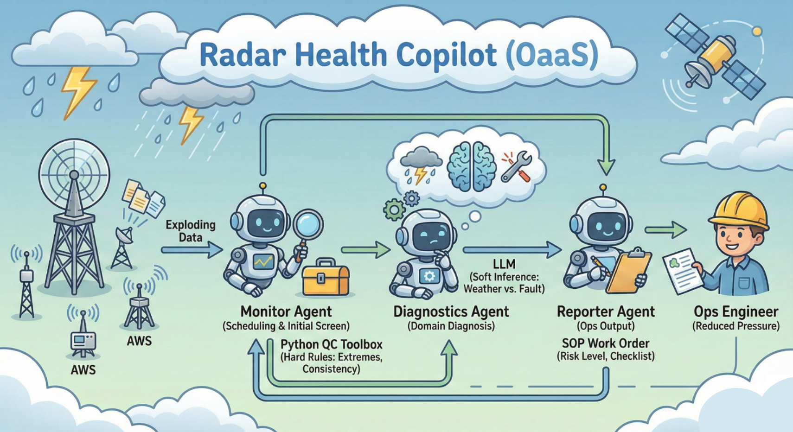

# Radar Health Copilot (OaaS)

[中文版 (Chinese Version)](README.zh-CN.md)

This repository is the capstone entry for the Kaggle Agents Intensive competition (https://www.kaggle.com/competitions/agents-intensive-capstone-project/overview). It delivers a minimal-yet-practical multi-agent workflow for radar and surface station operations, combining hard physics-based QC with soft LLM reasoning to turn raw observations into trustworthy, actionable maintenance insights.



## Why
- Rapid network growth: China has deployed a surge of radars and AWS sites; data volume outpaces manual checks.
- Reliability pressure: Subtle drifts, weak SNR, icing or wet radome issues need faster detection than daily log reviews.
- Limited experts: A small team must maintain many heterogeneous sensors—automation is essential.

## Approach
- Hard rules first: Python QC toolbox enforces physical bounds, spatial consistency, temporal steps, radar SNR/reflectivity bias, and cross-variable checks before anything hits the LLM.
- Soft reasoning after: Diagnostics agent weighs QC outputs plus metadata to separate true weather from hardware faults, with confidence and rationale.
- Standardized reporting: Reporter produces risk-graded SOP tickets for field technicians.

## Architecture
- Monitor (dispatcher + QC): Routes packets to QC tools (temperature, humidity, pressure, wind, precipitation, radar, composite).
- Diagnostics: Rule-informed reasoning over QC anomalies and context.
- Reporter: Markdown SOP ticket with risk level and action list.

## Layout
- `agents/`: QC toolbox, agents, demo entry (`app.py`).
- `tests/`: Pytest cases for QC and pipeline/streaming.
- `examples/`: Upstream Google ADK reference code.
- `data/sample_observations.csv`: Multi-variate stream sample for demos.

## Quickstart (offline)
1) Activate: `mamba activate py314-agent`
2) Demo: `python -m agents.app`
3) CSV/stream demo: `python -c "from agents.app import run_csv_stream_demo; run_csv_stream_demo()"`

## Tests
```bash
pip install pytest
pytest
```

## Optional LLM Mode
- Install `google-adk` and `google-genai`, set `GOOGLE_API_KEY`, then call `run_llm_monitor_once` in `agents/app.py` to reuse the Runner + LoggingPlugin setup.
